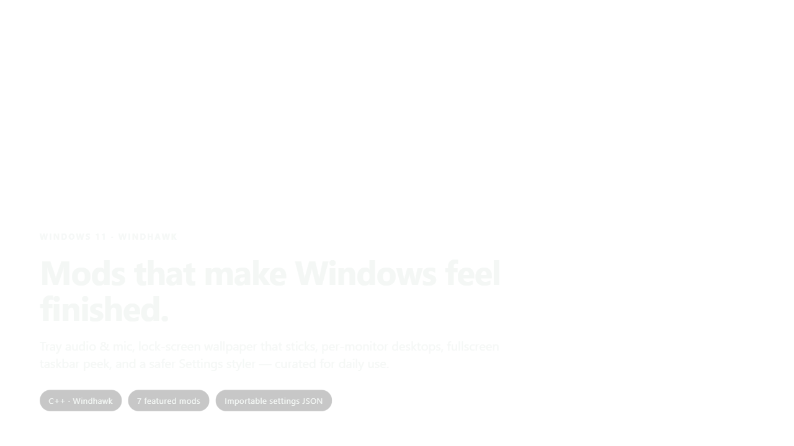
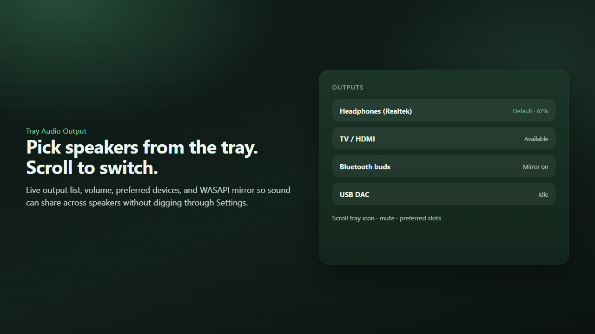
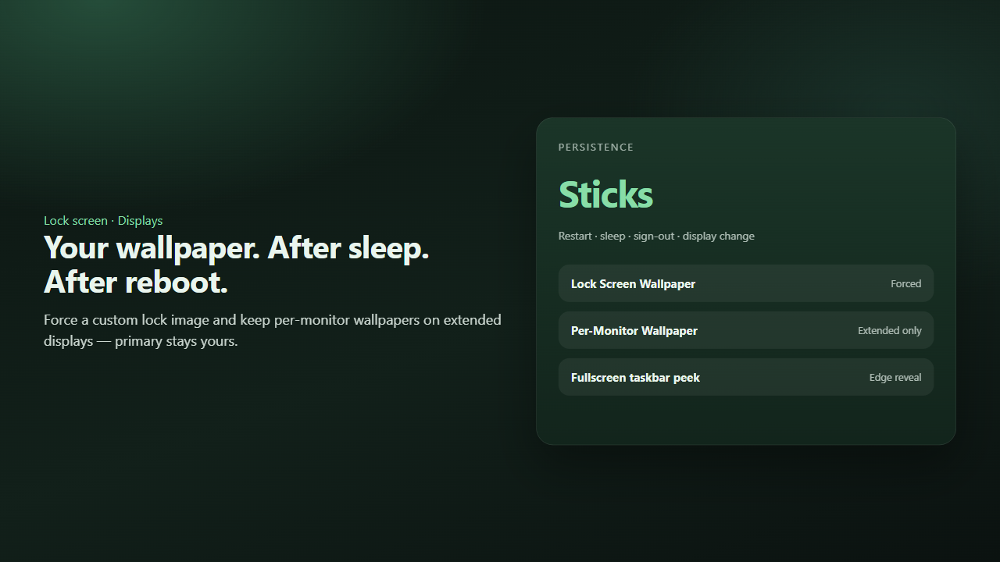

<div align="center">

# Windhawk Mods

**Mods that make Windows feel finished** — tray audio & mic, lock-screen wallpaper that sticks, per-monitor desktops, fullscreen taskbar peek, and a safer Settings styler.

[](https://www.microsoft.com/windows)
[](https://windhawk.net/)
[](https://isocpp.org/)
[](#license)

</div>

<div align="center">
  
</div>

---

## Why this exists

Windows 11 still hides everyday controls behind Settings deep-dives — switching speakers, locking a wallpaper after sleep, peeking the taskbar in fullscreen. **This repo is a curated set of Windhawk mods** (and a few careful forks) that fix those gaps for daily use, with importable settings JSON.

> Built by **Nishanth K R** — *son of a farmer, always a farmer.*

**Related:** [windows-system-maintenance](https://github.com/Nishanth1409/windows-system-maintenance) (desktop cleanup menu — no mods in that repo).

---

## What you can do

- **Tray Audio Output** — pick outputs, volume, scroll-to-switch, preferred devices, WASAPI mirror.
- **Mic Tray Switch** — live input list, gain %, mute, preferred slots, priority auto-switch.
- **Lock Screen Wallpaper** — force a custom lock image that survives reboot, sleep, and sign-out.
- **Per-Monitor Wallpaper** — wallpapers on extended displays only (primary never touched).
- **Fullscreen taskbar peek** — edge peek with auto-hide works like a normal window.
- **Translucent Windows** — Explorer-scoped translucency fork.
- **Settings Styler (safe)** — full styling engine without the XAML diagnostics crash on Background / Lock screen.

---

## Preview

<div align="center">
  
  <p><em>Tray Audio Output — speakers, volume, and mirror from the system tray.</em></p>
</div>

<div align="center">
  
  <p><em>Lock screen + per-monitor wallpaper + fullscreen taskbar peek.</em></p>
</div>

---

## Featured mods

| Mod | Folder | What it does |
| :--- | :--- | :--- |
| Lock Screen Wallpaper | `analysis/lock-screen-wallpaper` | Custom lock image that sticks after reboot/sleep |
| Mic Tray Switch & Control | `analysis/mic-tray-switch` | Tray mic list, gain, mute, preferred devices |
| Per-Monitor Wallpaper | `analysis/per-monitor-wallpaper` | Wallpapers on extended monitors only |
| Settings Styler (no XAML diagnostics) | `analysis/settings-styler-safe` | Settings Styler without the Background / Lock crash; blurred wallpaper backdrop when unfocused |
| Taskbar Auto-Hide Peek in Fullscreen | `analysis/taskbar-always-visible-fullscreen` | Edge peek works in fullscreen |
| Translucent Windows | `analysis/translucent-windows` | Native translucent effects (Explorer) |
| Tray Audio Output | `analysis/tray-audio-output` | Tray outputs, volume, scroll switch, mirror |

Each folder typically has: source (`.cpp` / `.wh.cpp`), `.bak` snapshot, settings JSON.

**Translucent Windows** is upstream by [Undisputed00x](https://github.com/Undisputed00x); this copy narrows `@include` to `explorer.exe`.

**Settings Styler (no XAML diagnostics)** is a fork of *Windows 11 Settings Styler* by [m417z](https://github.com/m417z) (GPL-3.0). Import existing Settings Styler configs as-is; leave **Theme** none and **Blurred wallpaper backdrop** on for the curated look.

Browse all mods under [`analysis/`](analysis/).

---

## Tech stack

| Layer | Technology |
| --- | --- |
| Runtime | [Windhawk](https://windhawk.net/) on Windows 11 |
| Mods | C++ (`.wh.cpp` / `.cpp`) targeting `windhawk.exe`, `explorer.exe`, Settings |
| Settings | Windhawk JSON (`.wh.json` / `.json`) + optional `.reg` helpers |
| CI | GitHub Actions validates mod folders |

---

## Getting started

### 1. Install Windhawk

Download from [windhawk.net](https://windhawk.net/).

### 2. Clone this repo

```bash
git clone https://github.com/Nishanth1409/windhawk-mods.git
cd windhawk-mods
```

### 3. Add a mod

1. Open Windhawk → create / open a mod  
2. Open `analysis/<mod-id>/<mod-id>.cpp` (or `.wh.cpp`)  
3. Copy all source into the Windhawk editor  
4. **Compile** (`Ctrl+B`) → enable the mod  
5. If the mod targets Explorer, restart Explorer or sign out/in  

### 4. Import settings

1. Open the mod’s settings in Windhawk  
2. Import the matching `analysis/<mod-id>/*.json` (or `.wh.json`)  
3. Replace any **placeholder** image/file paths with real paths on your PC  

Settings JSON may contain placeholder paths — replace them after import.

### Tips

- **Tray Audio / Mic Tray** run as tool mods (`windhawk.exe`). Check the hidden tray overflow if the icon is missing.  
- **Taskbar peek in fullscreen** needs *Settings → Personalization → Taskbar → Automatically hide the taskbar*.  
- After you **move a game**, update that mod’s **Excluded folders**, then reload so fullscreen peek stays disabled for those apps.  
- Do not run the original *Windows 11 Settings Styler* alongside `settings-styler-safe`.  

---

## License

MIT for mods authored by Nishanth K R unless noted. Upstream community mods: see each file’s `@license`. **Settings Styler (no XAML diagnostics)** inherits GPL-3.0 from the original Settings Styler.

---

## Live & credits

| | |
| :--- | :--- |
| **Author** | [Nishanth K R](https://github.com/Nishanth1409) |
| **Repo** | [Nishanth1409/windhawk-mods](https://github.com/Nishanth1409/windhawk-mods) |
| **Upstream credits** | [Undisputed00x](https://github.com/Undisputed00x) (Translucent Windows) · [m417z](https://github.com/m417z) (Windows 11 Settings Styler / GPL-3.0) |
| **Portfolio** | [nkrportfolio.vercel.app](https://nkrportfolio.vercel.app) |

---

<div align="center">

*Son of a farmer · always a farmer.*

[GitHub](https://github.com/Nishanth1409) · [Portfolio](https://nkrportfolio.vercel.app)

</div>

